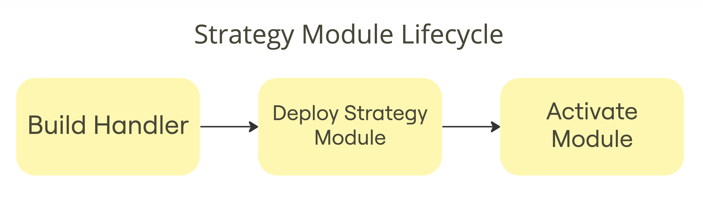

The **[Unhosted](https://unhosted.com/)** AA wallet draws its strength from the modular design of the [Biconomy smart account](https://docs.biconomy.io/), providing developers with the capability to intricately design and integrate custom modules. This unique approach not only allows developers to shape the wallet's features according to their needs but also encourages innovation in expanding its overall functionality.

### Strategy Module

Unhosted introduces Strategy Modules, enabling the `delegatecall` from smart account to execute arbitrary logic. This paves the way for an array of functionalities, from automated wallets to one-click DeFi strategies, offering boundless possibilities. At the core of Strategy Modules are **[Handlers](./Handlers)**, housing the arbitrary logic. Deploying these modules is permissionless, allowing developers to generate revenue based on user utilization of their modules. The Unhosted ecosystem beckons developers to explore the realm of limitless innovation and potential earnings.

### Handlers

Handlers serve as the immutable logic governing each strategy module by calling `execStrategy` function within the Unhosted ecosystem. Your role comes in when you develop these handlers your way. Your earnings are linked to the complexity and gas usage of your strategies.
It's essential to carefully design their structure since they function as delegate calls from the smart account and have the ability to alter the wallet's storage—a capability that should be restricted.

### Module Marketplace

Once you've crafted your handler and deployed the strategy module through the module factory, it becomes accessible for direct activation. While deploying and adding modules to the wallet is permissionless, we prioritize the security of handlers before making them available in the marketplace for all users to enable.