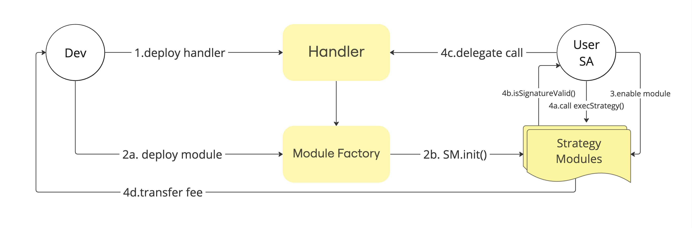

# Deploying Strategy Modules

If you haven't built your handler for the strategy module implementation, you can utilize our [handler library](./Handlers) for assistance.

### How It Works



After constructing your handler, deploy it on a supported network. Utilize the module factory by providing the handler address and the beneficiary's address for your strategy. The factory will then deploy a proxy with your handler as its implementation, and both the handler and beneficiary addresses become immutable. Different handlers may need distinct interfaces to interact with in the wallet, and we obtain your handler ABI for creating its interface. Feel free to reach out to us for any improvements in this process.

### Module Factory

This contract operates as a singleton registry, purpose-built for deploying Strategy Modules while receiving both the strategy implementation and beneficiary as inputs.

### Execute Strategy

To execute arbitrary data on the handler implementation, the module must be enabled, and the transaction must be signed by the Smart Account (SA) owner.

To execute the strategy, you need to call the execStrategy method, which checks the signature and calls the SA to perform the strategy.

The strategy module signatures are EIP-712 based. And uses the following scheme:

* EIP712Domain
  
```js
{
  "EIP712Domain": [
    { "type": "uint256", "name": "chainId" },
    { "type": "address", "name": "verifyingContract" }
  ]
}
```

* ExecuteStrategy

```js
{
  "ExecuteStrategy": [
    { "type": "address", "name": "handler" },
    { "type": "uint256", "name": "value" },
    { "type": "bytes", "name": "data" },
    { "type": "uint256", "name": "nonce" }
  ]
}
```

### Approval Mechanism

However, the module strategy factory is permissionless, allowing anyone to deploy their strategy with their handler implementation and add it to their wallet. Nonetheless, unhosted comes with its own approval mechanism, ensuring that only modules that have undergone security checks are displayed. This precaution is in place to prevent the addition of malicious code to users' wallets.