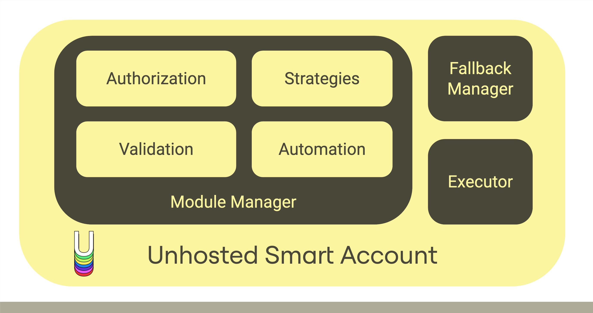

# Overview

Welcome to the Unhosted Wallet Documentation—a comprehensive guide to unlocking the full potential of your crypto experience. At Unhosted, we believe in democratizing the mastery of on-chain strategies, providing you with the tools and insights that were once reserved for seasoned experts. This documentation is your key to seamlessly navigate the crypto landscape, whether you're a novice or a seasoned player.

### Why Smart Account Wallets?

- Easier to onboard the next billion users of your dApp by creating wallets using social login instead of seedphrase.
- Customize and automate your wallet with modules featuring unlimited functionalities. Tailor your crypto experience, making it uniquely yours.
- Reduce initial friction by sponsoring gas fees for your users.
- Users for your dApp can batch transactions (no repeated approval or sign-in for your users)
- Abstract the complexity of gas fees by allowing your users to pay gas fees in tokens of the transaction.

## Getting Started

- Set up your Unhosted Wallet with step-by-step **[instructions](./category/create-smart-account)**.
- Dive into **[advanced features](./category/extend-smart-account)** and tips for maximizing your DeFi experience.

#### For Developers

- Unleash your development skills by creating personalized **[strategy modules](./category/for-developers)** using the account abstraction modular design. Earn a share of user fees when others utilize your module through our vibrant module marketplace.
